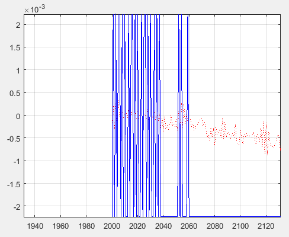

# Relatório de MNSE : Lab1
## Elaborado por Nuno Jorge Dias Carneiro Martins / up201405079

## 1. Parte introdutória

Na primeira parte do trabalho prático, é pedida a conversão de um ficheiro `.mp3` para o formato `.wav`, utilizando diferentes frequências de amostragem e relatar as diferenças.

Depois de realizados testes sobre um ficheiro genérico `.mp3`, foram notadas drásticas diferenças.

Enquanto que o ficheiro áudio que possui uma frequência de amostragem de `44100hz` demonstra uma qualidade muito semelhante à do ficheiro original, sem diferenças audíveis, o de `11025hz` possui uma qualidade bastante inferior, notando-se também que o som é vagamente mais grave e possui algum ruído.

Isto deve-se provavelmente à utilização de filtros por parte do programa VLC que cortam frequências altas.

## 2. Variação da frequência de amostragem usando ou não filtros

Na segunda parte deste trabalho, é pedida a realização de sub amostragem de um ficheiro de som `.wav`, sendo esta feita com os fatores inteiros 4 e 2, utilizando ou não filtros `passa baixo`.

Sub amostragem consiste na redução do número de amostras presentes no som utilizado. Ao realizar uma sub amostragem com fator 2, uma em cada duas amostras é mantida, enquanto que ao utilizar um fator 4, apenas se mantém uma em cada quatro amostras.

Para a realização dos testes, foi usado o ficheiro fornecido `batman_theme_x.wav` que possui `70464` amostras e uma frequência de amostragem de `11025hz`, em conjunto com 2 funções `Matlab` fornecidas `amostragemInterp_semFiltro.m` e `amostragemInterp_comFiltro.m`.

As duas funções reproduzem inicialmente o som com a taxa de amostragem normal, sendo este o gráfico resultante:

Como seria esperado, todas as frequências observadas estão abaixo da frequência de `Nyquist`, que possui um valor igual à metade da taxa de amostragem do sinal, que é `5512.5hz`.

Depois de realizada a sub amostragem do som, são obtidos os seguintes gráficos para os fatores `2` e `4` respetivamente:

Fator 2

Fator 4

Nos gráficos da esquerda, vê-se que o número de amostras do sinal foi reduzido com um fator igual ao mencionado.

Pode-se também observar que, devido ao efeito de aliasing, são introduzidas frequências altas que não existiam anteriormente.

Isto deve-se ao facto de que ao reduzir o número de  amostras, também se está a reduzir a taxa de amostragem, e, consequentemente, a frequência de `Nyquist` do sinal sub amostrado é menor. A frequência de `Nyquist` do sinal sub amostrado com `k=2` é `2756.25hz` e com `k=4` é `1378.125hz`. Isto impede que as frequências acima destas sejam reconstruidas com perfeito detalhe.

Ao não utilizar um filtro, os resultados obtidos depois da interpolação são os seguintes:

Fator 2

Fator 4

Como é evidente, embora a magnitude das baixas frequências seja relativamente realista, surgiram frequências altas mesmo depois da interpolação.

Torna-se assim necessário a utilização de um filtro `passa baixo` que permita cortar as frequências indesejadas:

Fator 2

Fator 4

Observando os gráficos da direita, conclui-se que o filtro atenua frequências aproximadamente para cima dos `4000hz` para a sub amostragem de fator 2 e `2000hz` para sub amostragem de fator 4, que são valores ligeiramente superiores às frequências de `Nyquist` dos sinais sub amostrados, pois não é necessário cortar todas as frequências que são muito pouco superiores à frequência de `Nyquist`.

As frequências que são pouco afetadas pelo filtro, ou não afetadas estão na banda passante, enquanto que as frequências que são atenuadas estão na banda de corte.

Depois de efetuada a interpolação dos sinais filtrados, obtêm-se os seguintes resultados:

Fator 2

Fator 4

Comprova-se assim que efetivamente as frequências indicadas anteriormente foram atenuadas de forma a prevenir o aparecimento de frequências altas que não estavam presentes.

Para os testes realizados, foram calculados os valores de `Erro médio quadrático` entre o sinal original e produzido, assim como a `Relação sinal-ruído de pico`, que indica a relação máxima entre a potência de um sinal e a potência do ruído sobreposto a este.

|Fator|Sem filtro|Com filtro| 
|:-:|:-:|:-:|
|**2**|`Erro = 0.009626 PSNR = 20.0974`|`Erro = 0.000824 PSNR = 30.7726`|
|**4**|`Erro = 0.042958 PSNR = 13.6015`|`Erro = 0.013163 PSNR = 18.7383`|

Como se pode confirmar pelos valores obtidos, fatores de sub amostragem menores geram um sinal com menor erro e maior PSNR, e a utilização de filtros também produz um erro menor e um PSNR maior.

Também se pode verificar que com um fator de 2 e utilização de filtro, o som possui um PSNR considerado aceitável, enquanto que os outros são medíocres, sendo o sem filtro e fator 4 o pior.

Dum ponto de vista subjetivo, os sons produzidos possuíam distinguidamente uma pior qualidade, principalmente com fator de sub amostragem 4, no entanto a utilização de filtros retirou bastante ruído e produziu um som mais grave, no entanto com melhor qualidade do que sem filtro.

## 3. Experiências de quantização

Na terceira e última parte deste trabalho prático, foi pedida para realizar uma quantização uniforme sobre um ficheiro `.wav` com pelo menos `44100hz` e `16 bits` por amostra, reduzindo o número de bits de amostra para `8` e `4 bits` e relatar as diferenças observadas.

Para a realização deste teste, foi utilizada a script fornecida `quant_uniform.m`, que permite observar as diferenças entre o som original e o som quantizado.

Os resultados obtidos foram os seguintes:

8 bits

4 bits

Como se vê nos primeiros gráficos, a quantização de `8 bits` produz um som relativamente próximo ao original, mas com uma ligeira perda de qualidade já que este número de bits apenas permite `256` níveis. No entanto, a quantização de `4 bits` produz um som muito diferente do original e é facilmente observável no gráfico os diferentes níveis possiveis a azul, que são `16`.

Dum ponto de vista subjetivo, a diferença entre `16` e `8` bits é percetível mas mínima, enquanto que `4` bits produz um som muito ruidoso, quase inaudível.

Devido a um erro na script, não é possível calcular o erro e o PSNR resultante da quantização, no entanto é previsível que o valor de PSNR de `16` bits seja ligeiramente superior ao de `8` bits, e que o de `4` bits seja muito inferior ao de `8` e `16`, e que o erro entre `16` e `8` seja inferior ao erro entre `16` e `4` bits.