# Relatório de MNSE : Lab 2
## Elaborado por Nuno Jorge Dias Carneiro Martins / up201405079

## 1. Espaços de cor

Na primeira parte deste trabalho, é pedido que se desenvolva uma script `Matlab` que leia um ficheiro `.bmp`(bitmap), e que seja analisa a representação deste em diferentes formatos, sendo estes `RGB`, `HSV`, `YCbCr` e `YUV`.

### 1.1. Conversão de RGB para HSV

Nesta parte, é pedida a criação de uma script que:

1 - leia um ficheiro no formato `.bmp` e mostre a imagem;  
2 - separe a imagem nas suas componentes `RGB` e mostre cada uma separadamente;  
3 - converta a imagem para o espaço de imagem `HSV` e apresente a imagem;  
4 - separe a imagem nas suas componentes `HSV` e mostre cada uma separadamente.

O código da script criada é o seguinte:

```matlab
function [] = ex11(imagePath);
[filepath,name,ext] = fileparts(imagePath)

%parte 1.1 i)
image = imread(imagePath);
if size(image,3) ~= 3
	image = cat(3,image,image,image);
end
disp('Imagem:');
figure(1),imshow(image),title('imagem original');
%parte 1.1 ii)
r = image(:,:,1);
g = image(:,:,2);
b = image(:,:,3);
figure(2),imshow(r),title('red');
figure(3),imshow(g),title('green');
figure(4),imshow(b),title('blue');

%parte 1.1 iii)
image2 = rgb2hsv(image);
disp('HSV');
figure(5),imshow(image2),title('imagem em hsv');

%parte 1.1 iv)
h = image2(:,:,1);
s = image2(:,:,2);
v = image2(:,:,3);
figure(6),imshow(h),title('hue');
figure(7),imshow(s),title('saturation');
figure(8),imshow(v),title('brightness');
```

Na primeira parte, é simplesmente lida a imagem através da utilização da função `imread()` e a imagem é mostrada com `imshow()`. Também é testado se a imagem está no formato `grayscale`, convertendo-a para `RGB` caso isto se verifique, sendo os valores de todas as componentes iguais.

De seguida, as imagens são separadas nas suas componentes `RGB`, sendo estes os resultados observados:

|Original|R|G|B|
|-|-|-|-|
|||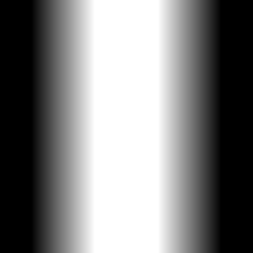||
|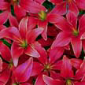||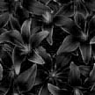|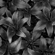|
|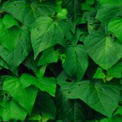|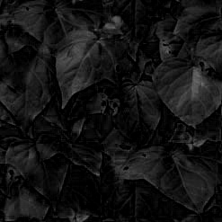||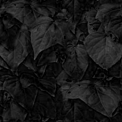|
|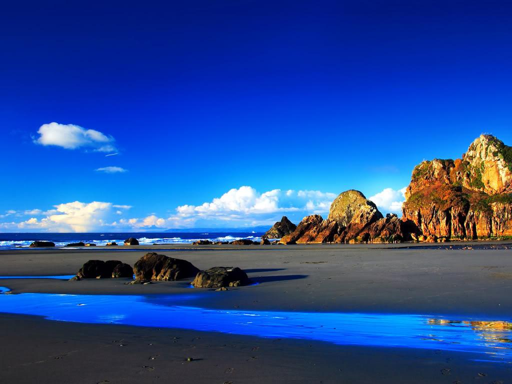|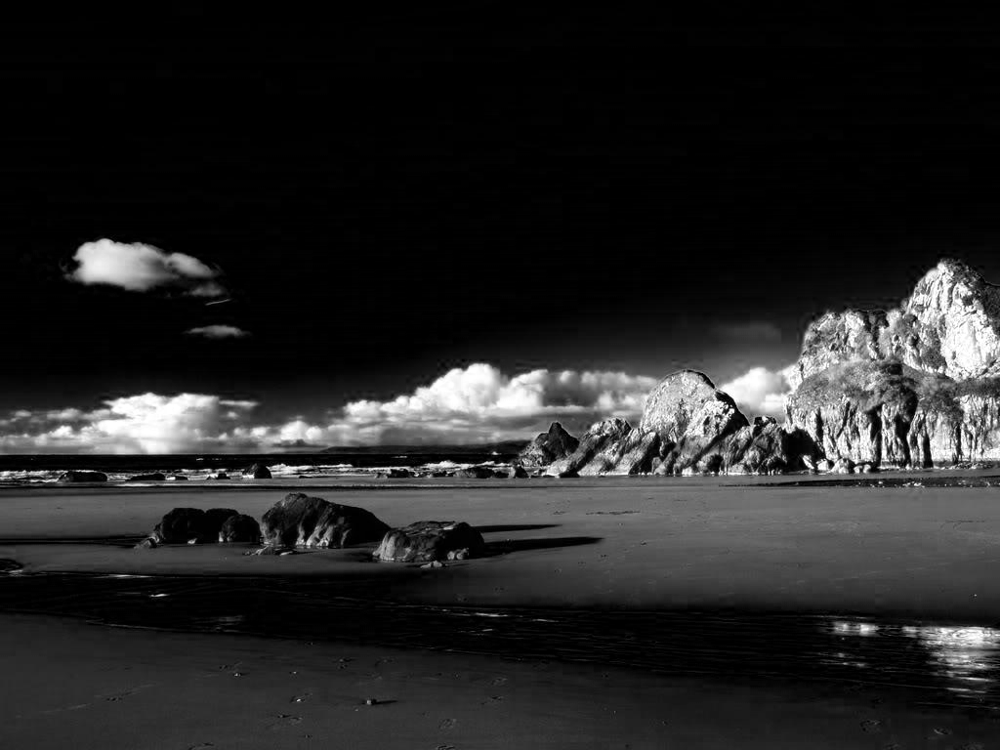|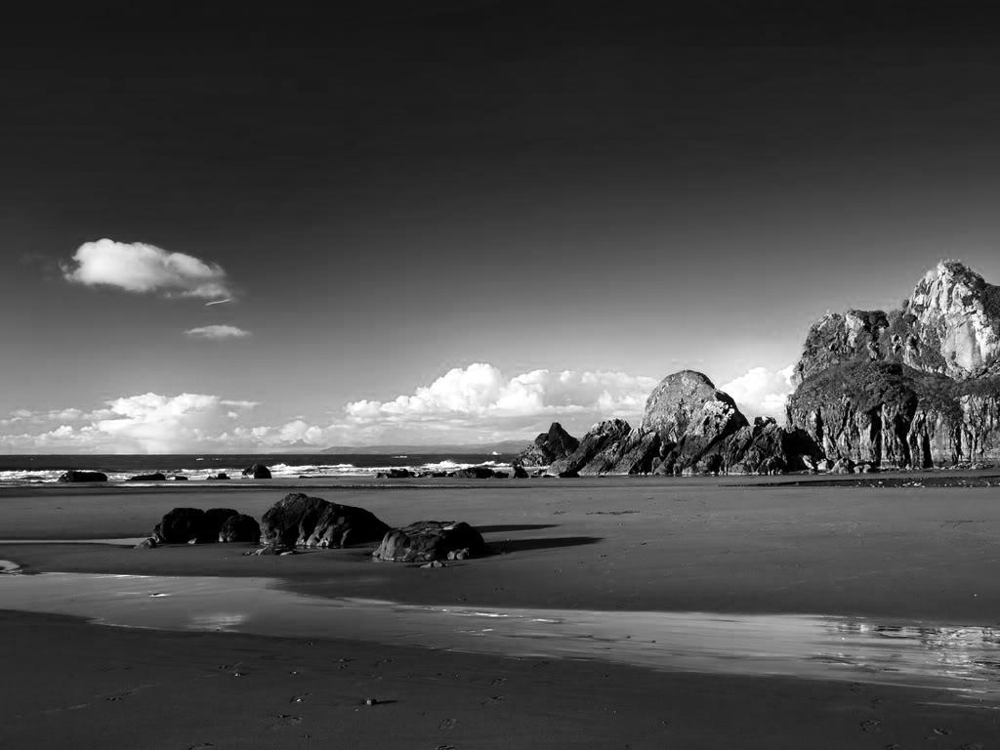|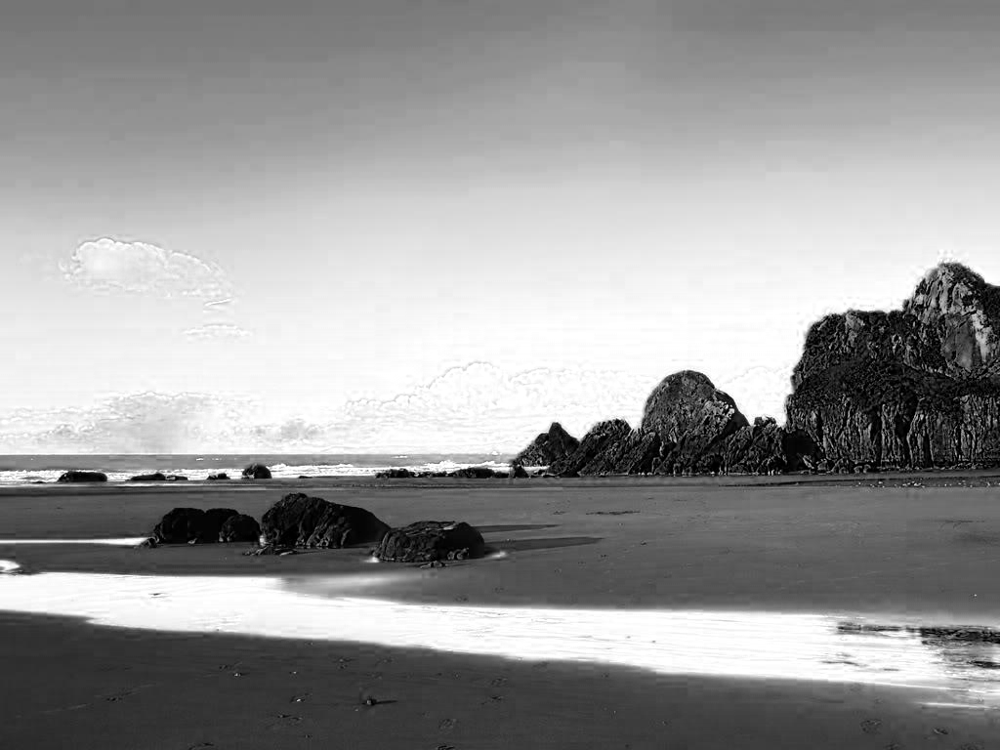|
|||||

No formato `RGB`, são usados 3 `bytes` para guardar cada pixel, sendo cada `byte` correspondente a uma cor: `Vermelho`, `Verde` ou `Azul`. As cores são obtidas através da mistura destas 3 cores, em quantidades determinadas. Quando a mistura das três cores está no valor mínimo (0, 0, 0), o resultado é a cor preta. Quanto está no máximo (255, 255, 255), resulta na cor branca. A utilização de valores menores gera cores mais escuras, e valores maiores geram cores claras.

Os resultados obtidos são os esperados. As cores mais predominantes nas imagens originais são mais claras na componente correspondente. Por exemplo, a componente vermelha das flores vermelhas é de longe a mais intensa, enquanto que a componente verde é a mais clara nas folhas verdes. Isto deve-se ao facto de estes componentes possuirem valores mais elevados, e quanto mais forte, mais claro é imprimido no ecrã. No caso do elefante, todas as componentes têm o mesmo valor, já que a imagem original está em `grayscale`.

Na parte seguinte, a imagem é convertida para o formato `HSV`, e os seus componentes são separados. Os resultados obtidos são os seguintes:

|Original|H|S|V|
|-|-|-|-|
||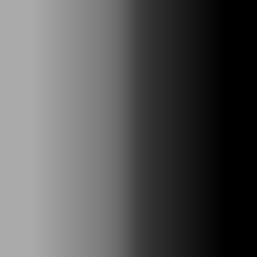|||
||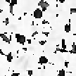|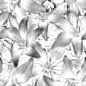|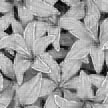|
||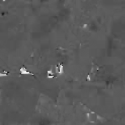|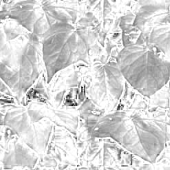|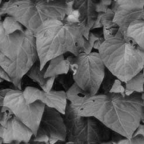|
||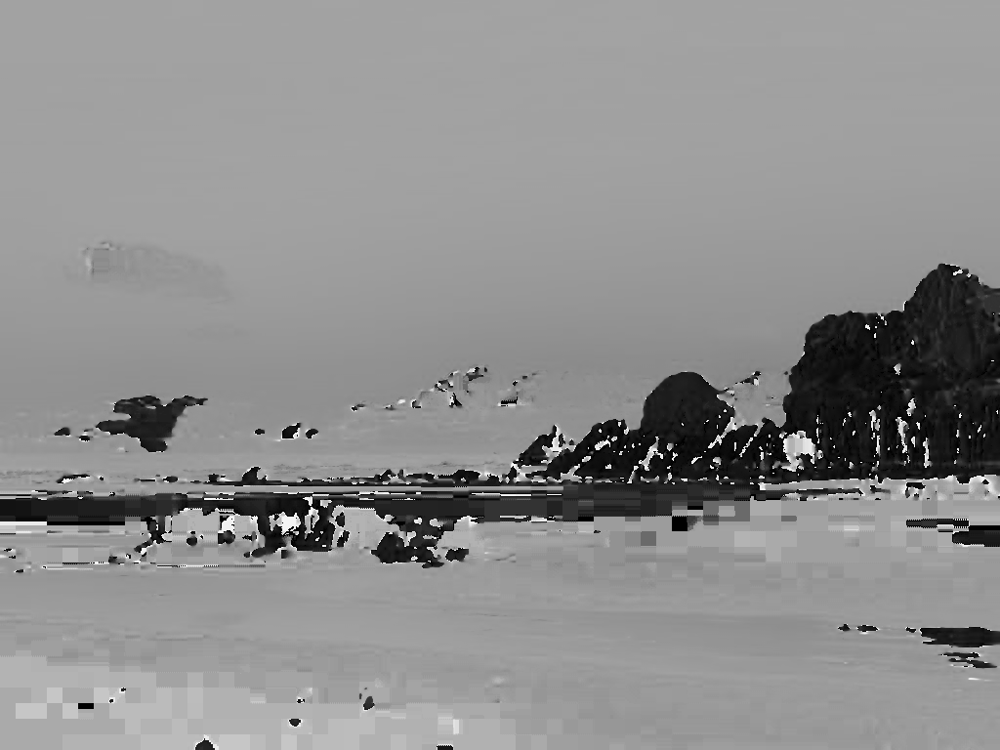|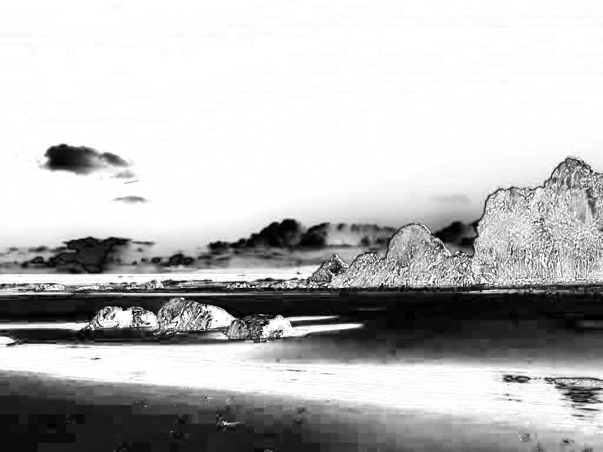|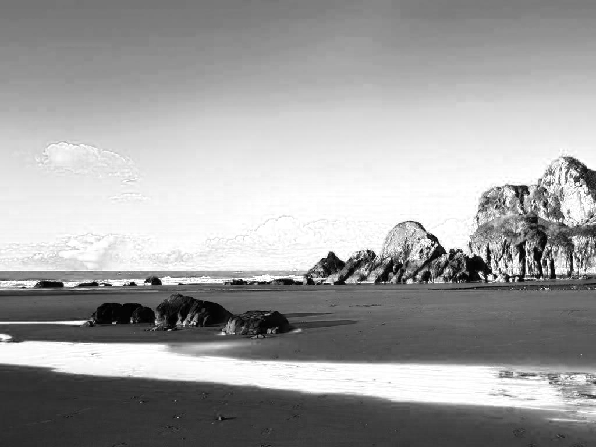|
|||||