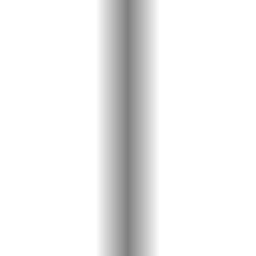

# Relatório de MNSE : Lab 2
## Elaborado por Nuno Jorge Dias Carneiro Martins / up201405079

## 1. Espaços de cor

Na primeira parte deste trabalho, é pedido que se desenvolva uma script `Matlab` que leia um ficheiro `.bmp`(bitmap), e que seja analisa a representação deste em diferentes formatos, sendo estes `RGB`, `HSV`, `YCbCr` e `YUV`.

### 1.1. Conversão de RGB para HSV

Nesta parte, é pedida a criação de uma script que:

1 - leia um ficheiro no formato `.bmp` e mostre a imagem;  
2 - separe a imagem nas suas componentes `RGB` e mostre cada uma separadamente;  
3 - converta a imagem para o espaço de imagem `HSV` e apresente a imagem;  
4 - separe a imagem nas suas componentes `HSV` e mostre cada uma separadamente.

O código da script criada é o seguinte:

```matlab
function [] = ex11(imagePath);
[filepath,name,ext] = fileparts(imagePath)

%parte 1.1 i)
image = imread(imagePath);
if size(image,3) ~= 3
	image = cat(3,image,image,image);
end
disp('Imagem:');
figure(1),imshow(image),title('imagem original');
%parte 1.1 ii)
r = image(:,:,1);
g = image(:,:,2);
b = image(:,:,3);
figure(2),imshow(r),title('red');
figure(3),imshow(g),title('green');
figure(4),imshow(b),title('blue');

%parte 1.1 iii)
image2 = rgb2hsv(image);
disp('HSV');
figure(5),imshow(image2),title('imagem em hsv');

%parte 1.1 iv)
h = image2(:,:,1);
s = image2(:,:,2);
v = image2(:,:,3);
figure(6),imshow(h),title('hue');
figure(7),imshow(s),title('saturation');
figure(8),imshow(v),title('brightness');
```

Na primeira parte, é simplesmente lida a imagem através da utilização da função `imread()` e a imagem é mostrada com `imshow()`. Também é testado se a imagem está no formato `grayscale`, convertendo-a para `RGB` caso isto se verifique, sendo os valores de todas as componentes iguais.

De seguida, as imagens são separadas nas suas componentes `RGB`, sendo estes os resultados observados:

|Original|R|G|B|
|-|-|-|-|
|||||
|||||
|||||
|||||
|||||

No formato `RGB`, são usados 3 `bytes` para guardar cada pixel, sendo cada `byte` correspondente a uma cor: `Vermelho`, `Verde` ou `Azul`. As cores são obtidas através da mistura destas 3 cores, em quantidades determinadas. Quando a mistura das três cores está no valor mínimo (0, 0, 0), o resultado é a cor preta. Quanto está no máximo (255, 255, 255), resulta na cor branca. A utilização de valores menores gera cores mais escuras, e valores maiores geram cores claras.

Os resultados obtidos são os esperados. As cores mais predominantes nas imagens originais são mais claras na componente correspondente. Por exemplo, a componente vermelha das flores vermelhas é de longe a mais intensa, enquanto que a componente verde é a mais clara nas folhas verdes. Isto deve-se ao facto de estes componentes possuirem valores mais elevados, e quanto mais forte, mais claro é imprimido no ecrã. No caso do elefante, todas as componentes têm o mesmo valor, já que a imagem original está em `grayscale`.

Na parte seguinte, a imagem é convertida para o formato `HSV`, e os seus componentes são separados. Os resultados obtidos são os seguintes:

|Original|H|S|V|
|-|-|-|-|
|||||
|||||
|||||
|||||
|||||

No formato `HSV`, sigla para (Hue,Saturation,Value), o primeiro `byte` representa o ângulo no círculo das cores do pixel(ou seja, a cor), o 2º `byte` representa a pureza desta cor e o 3º `byte` define o brilho do pixel.

Na primeira imagem, observa-se que `vermelho` possuí um valor menor, pois tem um angulo menor no círculo das cores, enquanto que o azul tem um valor alto, pelo que possuí um ângulo elevado no círculo.  
Este padrão verifica-se nos valores de `Hue` das outras imagens, com o caso especial das flores vermelhas, que possuí um valor elevado embora a cor seja vermelha. Isto deve-se ao facto de ser um vermelho rosado, pelo que tem um ângulo ligeiramente inferior ao vermelho, e, por isso, um valor elevado.
Os valores de `Saturação` e `Brilho` também estão de acordo com o previsto, sendo a 1ª mais elevada em zonas cuja cor é mais ou menos pura(por exemplo, o céu da praia em contraste com a areia) e a 2ª mais brilhante onde as imagens são mais claras(como por exemplo nas folhas verdes em contraste com os pontos vazios com sombra).
Também se verifica que na imagem do elefante os valores de `Hue` e `Saturation` são 0. O facto de a saturação ser 0 deve-se ao facto do cálculo deste valor ser igual a `(MAX-MIN)/MAX` (sendo `MAX` o maior valor no espaço `RGB` e `MIN` o menor). Como a imagem está em escala cinza, estes valores serão sempre iguais, pelo que a saturação será sempre 0. De notar também que o valor de `Hue` é 0 pois `MAX = MIN`. Como o valor do `Brilho` é igual a `MAX`, a componente brilho será igual à imagem original nesta imagem, pois todas as componentes `RGB` têm um valor igual.

### 1.2. Conversão de RGB para YCbCr

Nesta secção, foi desenvolvida uma script que converte uma imagem do formato `RGB` para uma imagem no formato `YCbCr`.

O código desenvolvido é o seguinte(trata-se de uma extensão do código desenvolvido para a parte anterior):

```matlab
%parte 1.2
image3 = rgb2ycbcr(image);
figure(9),imshow(image3),title('imagem em ycbcr');

y = image3(:,:,1);
cb = image3(:,:,2);
cr = image3(:,:,3);
figure(10),imshow(y),title('luminance');
figure(11),imshow(cb),title('cb');
figure(12),imshow(image),title('cr');
```

O resultados obtidos foram os seguintes:

|Original|Y|Cb|Cr|
|-|-|-|-|
|||||
|||||
|||||
|||||
|||||

No modelo `YCbCr`, `Y` representa a luminância. Esta é uma soma pesada das 3 componentes `RGB`, tendo maior intensidade na componente `Verde` pois os olhos humanos são mais sensiveis a esta e menos a `Azul`. `Cb` e `Cr` representam as `crominâncias` azul e vermelha, que são a subtração da `luminância` pelos valores de `B` e `R`. Estas componentes guardam informação menos imperativa à representação da imagem relativa principalmente às cores `Azul` e `Vermelha`.
Este formato possuí a vantagem de separar a `luminância`, que é o fator mais importante na representação das imagens, dos valores de `crominância` que são menos importantes, permitindo a realização de `subsampling` a estas componentes sem grande perda de qualidade, pois os olhos não são tão sensíveis a estas.

Nas imagens produzidas, observa-se que as que representam a `luminância` possuem uma maior nitidez do que as de `crominância`. As primeiras são muito próximas do que seria uma imagem em `greyscale` na escala `RGB`, no entanto tem maior intensidade nas zonas `verdes` do que `vermelhas` e `azuis`. Por exemplo, na imagem das folhas verdes, observa-se que as `crominâncias` possuem um valor baixo, enquanto que a `crominância vermelha` apresenta um valor ligeiramente elevado para as flores vermelhas, e a `crominância azul` para o céu na praia.

### 1.3 Conversão de RGB para YUV

## 2. Variação  das  dimensões  espaciais  de  imagem  usando  ou  não  filtros  com imagem de teste “imzoneplate”

## 3. Experiências de filtragem