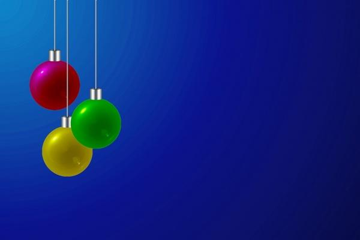
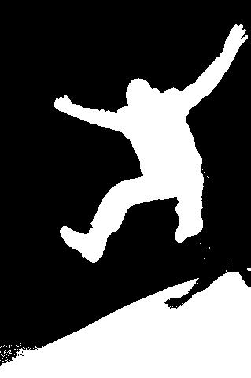

# Relatório de MNSE : Lab 3
## Elaborado por Nuno Jorge Dias Carneiro Martins / up201405079

## Introdução

Este relatório foi elaborado como meio para relatar os resultados das experiências sugeridas no Lab 3.

## 1. Blue background extraction

O objetivo deste exercício é praticar diferentes técnicas para extrair fundos azuis de imagens, mencionando as suas vantagens e desvantagens.

### 1.1 Basic segmentation

Na primeira parte deste trabalho, foi pedida a criação de uma script que:

1 - leia uma imagem em qualquer formato com um fundo azul;  
2 - separe a imagem nas suas componentes RGB e mostre cada uma separadamente;  
3 - mostrar um histograma da componente azul da imagem;  
4 - segmente a imagem em preto ou branco, dependendo se cada píxel da componente azul tem um valor superior ou inferior a um certo threshold.

O código utilizado é o seguinte:

```Matlab
function [] = ex11(imagePath);
[filepath,name,ext] = fileparts(imagePath)

%resolução do exercicio 1.1 de lab3

%ler imagem e converte-la para rgb se for greyscale
image = imread(imagePath);
if size(image,3) ~= 3
	image = cat(3,image,image,image);
end

[height, width, planes] = size(image);

disp('Imagem:');
figure(1),imshow(image),title('imagem original');
%separar componentes
r = image(:,:,1);
g = image(:,:,2);
b = image(:,:,3);
figure(2),imshow(r),title('red');
figure(3),imshow(g),title('green');
figure(4),imshow(b),title('blue');
%mostrar histograma azul e pedir threshold
hfig = figure(5),imhist(b), title(' B channel histogram');
threshold=input('Which threshold?');
%criar imagem preta e branca com threshhold azul
c=zeros(height, width);
for i=1:height
    for j=1:width
        if(b(i,j)<threshold) c(i,j)=255;
        end
    end
end
figure(6),imshow(c),title('blue threshhold');

%exportar imagens
imwrite(image,strcat('outputs/',name,'-','original',ext));
imwrite(r,strcat('outputs/',name,'-','red',ext));
imwrite(g,strcat('outputs/',name,'-','green',ext));
imwrite(b,strcat('outputs/',name,'-','blue',ext));
imwrite(c,strcat('outputs/',name,'-','bluethreshold-',int2str(threshold),ext));
saveas(hfig,strcat('outputs/',name,'-','histogram',ext));
```

Os resultados obtidos são os seguintes:

|Original|R|G|B|
|-|-|-|-|
|||||
|||||
|||||

Pode-se observar que a componente azui tem valores elevados em zonas azuis das imagens testadas, no entanto também possuí valores elevados em zonas brancas e claras, como na neve, nos reflexos da luz nas bolas de natal e no corpo do pássaro.

Isto pode ser um problema ao utilizar este método, pois estas zonas podem ser potencialmente removidas da imagem quando não deveriam ser.

|Original|Histograma da componente Azul|
|-|-|
|||

Observa-se no histograma que a maior densidade de azuis encontra-se da zona 205-225, e observando a imagem, infere-se que esta densidade é devida ao céu.

|Threshold 150|Threshold 205|
|-|-|
|||

Ao utilizar um threshold de 150, todo o céu foi removido da imagem, no entanto também foram removidas algumas partes do pássaro, incluindo as suas asas. Utilizando um threshold de 205, já se obtem uma imagem mais próxima dos resultados pretendidos, no entanto surgem alguns artefactos, como na parte esquerda da imagem.

|Original|Histograma da componente Azul|
|-|-|
|||

Nesta imagem já existe uma maior distribuição dos azuis, devido à fonte de luz presente no canto superior esquerdo.

|Threshold 60|Threshold 100|
|-|-|
|||

Para um threshold de 60, que é onde começa a maior densidade azul, todo o fundo é removido, no entanto também são removidos os fios azuis já que possuem uma componente azul elevada, assim como o reflexo da bola vermelha, que é roxo. Ao utilizar um threshold de 100, já se obtém uma ligeira parte da bola vermelha, no entanto não são capturados pixeis azul-escuro presentes no canto inferior direito.

|Original|Histograma da componente Azul|
|-|-|
|||

Existe uma grande distribuição de azuis, no entanto a secção entre 220-250 pertence à neve, pelo que esta tem um threshold superior.

|Threshold 90|Threshold 210|
|-|-|
|||

Observa-se que ao usar um threshold de 210, apenas a neve é removida, confirmando-se que a gama 210-250 pertence à neve. Utilizando um threshold de 60, todo o céu é removido, no entanto também a neve já que possuí um threshold superior, assim como muitas secções do homem.

Devido à incapacidade desta técnica de distinguir secções na imagem exclusivamente azuis, torna-se difícil encontrar uma combinação de cores que produzam o resultado pretendido. É assim  necessário usar outra técnica.

### 1.2 Alternative segmentation

Este é um método de segmentação que não possuí o mesmo problema que o anterior.

Em vez de utilizar um threshold da componente azul para decidir o que eliminar, este método usa a componente `blueness`, que indica o quão puramente azul o píxel é. A fórmla desta componente é `blueness = Blue - max(Red,Green)`.

O código criado para esta secção é o seguinte:

```matlab
function [] = ex11(imagePath);
[filepath,name,ext] = fileparts(imagePath)

%resolução do exercicio 1.1 de lab3

%ler imagem e converte-la para rgb se for greyscale
image = imread(imagePath);
if size(image,3) ~= 3
	image = cat(3,image,image,image);
end

[height, width, planes] = size(image);

disp('Imagem:');
figure(1),imshow(image),title('imagem original');
%separar componentes
r = image(:,:,1);
g = image(:,:,2);
b = image(:,:,3);
figure(2),imshow(r),title('red');
figure(3),imshow(g),title('green');
figure(4),imshow(b),title('blue');
%calcula blueness
b2 = b;
for i=1:height
    for j=1:width
		b2(i,j) = b(i,j) - max(r(i,j),g(i,j));
    end
end
%mostrar histograma azul e pedir threshold
hfig = figure(5),imhist(b2), title('Blueness channel histogram');
threshold=input('Which threshold?');
%criar imagem preta e branca com threshhold azul
c=zeros(height, width);
for i=1:height
    for j=1:width
        if(b2(i,j)<threshold) c(i,j)=255;
        end
    end
end
figure(6),imshow(c),title('blue threshhold');

%exportar imagens
imwrite(image,strcat('outputs/',name,'-','original',ext));
imwrite(r,strcat('outputs/',name,'-','red',ext));
imwrite(g,strcat('outputs/',name,'-','green',ext));
imwrite(b,strcat('outputs/',name,'-','blue',ext));
imwrite(c,strcat('outputs/',name,'-','bluenessthreshold-',int2str(threshold),ext));
saveas(hfig,strcat('outputs/',name,'-','histogramblueness',ext));
```

Para este método, os resultados obtidos foram os seguintes:

|Original|Histograma da componente Blueness|
|-|-|
|||

Observa-se que os valores de blueness são inferiores aos valores de blue, pois resultam da diferença entre a componente azul e a componente vermelha ou verde.

|Threshold 60|Threshold 75|
|-|-|
|||

Observa-se que este método resolveu o problema de partes do corpo do pássaro estarem incluidas na imagem, no entanto continua a não capturar bem as asas, pois estas são muito transparentes.

|Original|Histograma da componente Blueness|
|-|-|
|||

|Threshold 50|
|-|
||

Neste caso, o resultado foi totalmente o esperado. Não foram incluidas os fios brancos, assim como a reflexão roxa da bola vermelha. Isto deve-se ao seu valor de blueness ser menor, embora o seu valor de blue possa ser elevado.

|Original|Histograma da componente Blueness|
|-|-|
|||

|Threshold 30|Threshold 40|
|-|-|
|||

Esta é a imagem que pior se comportou, pois para o threshold de 30, a sombra do homem também foi capturada. Aumentando o threshold para 40, esta já é ignorada, no entanto não é eliminada uma ligeira área de céu no canto inferior esquerdo.

Conclui-se assim que, embora o segundo método requira um maior número de cálculos, produz resultados superiores para todos os casos testados, já que apenas afeta secções de imagem puramente azuis, que são o alvo principal, e não zonas com componente azul elevada que não sejam desta cor.

## 2. Adding objects to another image

Na segunda e última parte deste trabalho, foi pedido o desenvolvimento de uma script que, utilizando as segmentações geradas no exercício anterior, crie uma superimposição da imagem segmentada sobre a imagem original, sendo efetivamente removidas as partes que estão a preto, e sendo mantidas as partes que estão a branco.

O código da script desenvolvida é o seguinte:

```Matlab

```
